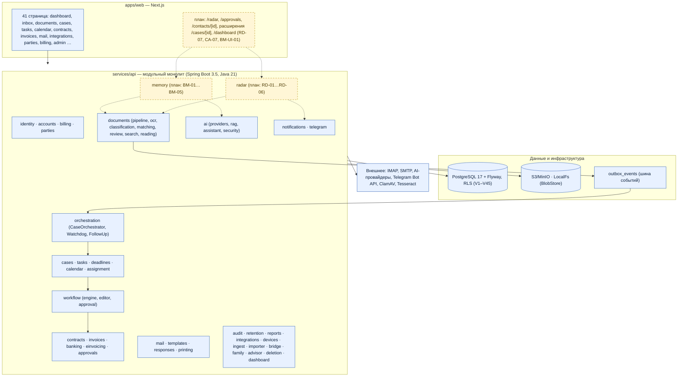

# Общая схема модулей

```mermaid
flowchart TB
  classDef exists fill:#e8f1ff,stroke:#2f5fb3,color:#0b1f3a
  classDef plan fill:#fff6d6,stroke:#b38600,stroke-dasharray: 5 4,color:#4a3800

  subgraph Web["apps/web — Next.js"]
    UI["41 страница: dashboard, inbox, documents, cases, tasks, calendar, contracts, invoices, mail, integrations, parties, billing, admin …"]:::exists
    UIplan["план: /radar, /approvals, /contacts/[id], расширения /cases/[id], /dashboard (RD-07, CA-07, BM-UI-01)"]:::plan
  end

  subgraph API["services/api — модульный монолит (Spring Boot 3.5, Java 21)"]
    direction TB
    ID["identity · accounts · billing · parties"]:::exists
    DOC["documents (pipeline, ocr, classification, matching, review, search, reading)"]:::exists
    ORCH["orchestration (CaseOrchestrator, Watchdog, FollowUp)"]:::exists
    CASE["cases · tasks · deadlines · calendar · assignment"]:::exists
    FIN["contracts · invoices · banking · einvoicing · approvals"]:::exists
    COMM["mail · templates · responses · printing"]:::exists
    WF["workflow (engine, editor, approval)"]:::exists
    AI["ai (providers, rag, assistant, security)"]:::exists
    NOTIF["notifications · telegram"]:::exists
    SUP["audit · retention · reports · integrations · devices · ingest · importer · bridge · family · advisor · deletion · dashboard"]:::exists
    MEM["memory (план: BM-01…BM-05)"]:::plan
    RAD["radar (план: RD-01…RD-06)"]:::plan
  end

  subgraph Data["Данные и инфраструктура"]
    PG[("PostgreSQL 17 + Flyway, RLS (V1–V45)")]:::exists
    OBJ[("S3/MinIO · LocalFs (BlobStore)")]:::exists
    OUTBOX["outbox_events (шина событий)"]:::exists
  end

  EXT["Внешнее: IMAP, SMTP, AI-провайдеры, Telegram Bot API, ClamAV, Tesseract"]:::exists

  UI --> API
  UIplan -.-> MEM
  UIplan -.-> RAD
  DOC --> OUTBOX --> ORCH
  ORCH --> CASE
  CASE --> WF
  WF --> FIN
  RAD -.-> NOTIF
  RAD -.-> DOC
  MEM -.-> DOC
  MEM -.-> AI
  API --> PG
  API --> OBJ
  API --> EXT
```

Worker — тот же артефакт `services/api` с профилем `worker` (ADR-02); отдельных каталогов `services/document-worker` и `services/ai-worker` нет (строка S01-02 матрицы).
