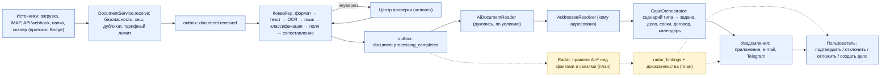

# Потоки данных

```mermaid
flowchart LR
  classDef exists fill:#e8f1ff,stroke:#2f5fb3,color:#0b1f3a
  classDef plan fill:#fff6d6,stroke:#b38600,stroke-dasharray: 5 4,color:#4a3800

  SRC["Источники: загрузка, IMAP, API/webhook, папка, сканер (протокол Bridge)"]:::exists
  RECV["DocumentService.receive: безопасность, хеш, дубликат, тарифный лимит"]:::exists
  OB1["outbox: document.received"]:::exists
  PIPE["Конвейер: формат → текст → OCR → язык → классификация → поля → сопоставление"]:::exists
  REVIEW["Центр проверки (человек)"]:::exists
  OB2["outbox: document.processing_completed"]:::exists
  ADDR["AddresseeResolver (кому адресовано)"]:::exists
  AIR["AiDocumentReader (рукопись, по условию)"]:::exists
  ORCH["CaseOrchestrator: сценарий типа → задача, дело, сроки, договор, календарь"]:::exists
  RULES["Radar: правила A–F над фактами и связями (план)"]:::plan
  FIND["radar_findings + доказательства (план)"]:::plan
  NOTIFY["Уведомления: приложение, e-mail, Telegram"]:::exists
  USER["Пользователь: подтвердить / отклонить / отложить / создать дело"]:::exists

  SRC --> RECV --> OB1 --> PIPE
  PIPE -->|"неуверен"| REVIEW --> PIPE
  PIPE --> OB2 --> AIR --> ADDR --> ORCH
  OB2 -.-> RULES
  ORCH --> NOTIFY
  RULES -.-> FIND -.-> NOTIFY
  FIND -.-> USER
  NOTIFY --> USER
```

Потоки событий проходят через outbox: повторная доставка идемпотентна (`OutboxDispatcherIT`). Шаги «Radar» отсутствуют в коде.
