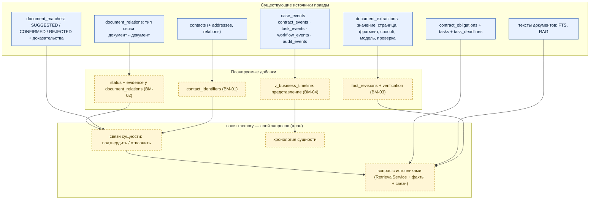

# Business Memory: из чего строится

```mermaid
flowchart TB
  classDef exists fill:#e8f1ff,stroke:#2f5fb3,color:#0b1f3a
  classDef plan fill:#fff6d6,stroke:#b38600,stroke-dasharray: 5 4,color:#4a3800

  subgraph Sources["Существующие источники правды"]
    C["contacts (+ addresses, relations)"]:::exists
    X["document_extractions: значение, страница, фрагмент, способ, модель, проверка"]:::exists
    M["document_matches: SUGGESTED / CONFIRMED / REJECTED + доказательства"]:::exists
    R["document_relations: тип связи документ↔документ"]:::exists
    O["contract_obligations + tasks + task_deadlines"]:::exists
    E["case_events · contract_events · task_events · workflow_events · audit_events"]:::exists
    T["тексты документов: FTS, RAG"]:::exists
  end

  subgraph Add["Планируемые добавки"]
    CI["contact_identifiers (BM-01)"]:::plan
    RS["status + evidence у document_relations (BM-02)"]:::plan
    FR["fact_revisions + verification (BM-03)"]:::plan
    TL["v_business_timeline: представление (BM-04)"]:::plan
  end

  subgraph Memory["пакет memory — слой запросов (план)"]
    Q1["связи сущности: подтвердить / отклонить"]:::plan
    Q2["хронология сущности"]:::plan
    Q3["вопрос с источниками (RetrievalService + факты + связи)"]:::plan
  end

  C --> CI
  R --> RS
  X --> FR
  E --> TL
  CI --> Q1
  M --> Q1
  RS --> Q1
  TL --> Q2
  FR --> Q3
  T --> Q3
  O --> Q3
  Q1 --> Q3
```

Границы: отдельного индекса и универсальной таблицы связей нет (D-02, D-05). Доступ к данным фильтруется правами в запросе.
