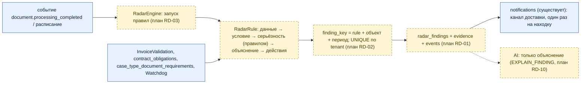
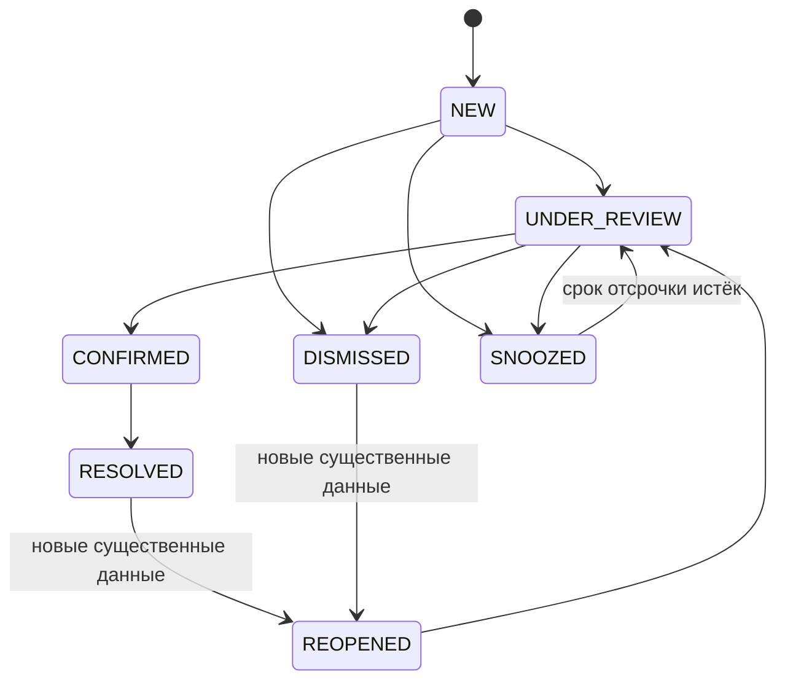

# Движок Radar и жизненный цикл находки

```mermaid
flowchart LR
  classDef plan fill:#fff6d6,stroke:#b38600,stroke-dasharray: 5 4,color:#4a3800
  classDef exists fill:#e8f1ff,stroke:#2f5fb3,color:#0b1f3a

  EV["событие document.processing_completed / расписание"]:::exists
  ENG["RadarEngine: запуск правил (план RD-03)"]:::plan
  RULE["RadarRule: данные → условие → серьёзность (правилом) → объяснение → действия"]:::plan
  SRC1["InvoiceValidation, contract_obligations, case_type_document_requirements, Watchdog"]:::exists
  KEY["finding_key = rule + объект + период; UNIQUE по tenant (план RD-02)"]:::plan
  FIND["radar_findings + evidence + events (план RD-01)"]:::plan
  NOTE["notifications (существует): канал доставки, один раз на находку"]:::exists
  AI["AI: только объяснение (EXPLAIN_FINDING, план RD-10)"]:::plan

  EV --> ENG --> RULE
  SRC1 --> RULE
  RULE --> KEY --> FIND --> NOTE
  FIND -.-> AI
```

```mermaid
stateDiagram-v2
  [*] --> NEW
  NEW --> UNDER_REVIEW
  NEW --> DISMISSED
  UNDER_REVIEW --> CONFIRMED
  UNDER_REVIEW --> DISMISSED
  NEW --> SNOOZED
  UNDER_REVIEW --> SNOOZED
  SNOOZED --> UNDER_REVIEW: срок отсрочки истёк
  CONFIRMED --> RESOLVED
  RESOLVED --> REOPENED: новые существенные данные
  DISMISSED --> REOPENED: новые существенные данные
  REOPENED --> UNDER_REVIEW
```

Переходы разрешает только backend. Диаграмма — проект (RD-01); таблиц и автомата в коде нет.
