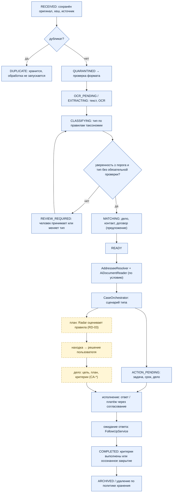

# Путь документа: от получения до завершения дела

```mermaid
flowchart TB
  classDef exists fill:#e8f1ff,stroke:#2f5fb3,color:#0b1f3a
  classDef plan fill:#fff6d6,stroke:#b38600,stroke-dasharray: 5 4,color:#4a3800

  A["RECEIVED: сохранён оригинал, хеш, источник"]:::exists
  A --> B{"дубликат?"}:::exists
  B -->|да| B1["DUPLICATE: хранится, обработка не запускается"]:::exists
  B -->|нет| C["QUARANTINED → проверка формата"]:::exists
  C --> D["OCR_PENDING / EXTRACTING: текст, OCR"]:::exists
  D --> E["CLASSIFYING: тип по правилам таксономии"]:::exists
  E --> F{"уверенность ≥ порога и тип без обязательной проверки?"}:::exists
  F -->|нет| G["REVIEW_REQUIRED: человек принимает или меняет тип"]:::exists
  G --> E
  F -->|да| H["MATCHING: дело, контакт, договор (предложение)"]:::exists
  H --> I["READY"]:::exists
  I --> J["AddresseeResolver + AiDocumentReader (по условию)"]:::exists
  J --> K["CaseOrchestrator: сценарий типа"]:::exists
  K --> L["ACTION_PENDING: задача, срок, дело"]:::exists
  K --> R["план: Radar оценивает правила (RD-03)"]:::plan
  R --> S["находка → решение пользователя"]:::plan
  S --> T["дело: цель, план, критерии (CA-*)"]:::plan
  L --> M["исполнение: ответ / платёж через согласование"]:::exists
  T --> M
  M --> N["ожидание ответа: FollowUpService"]:::exists
  N --> O["COMPLETED: критерии выполнены или осознанное закрытие"]:::exists
  O --> P["ARCHIVED / удаление по политике хранения"]:::exists
```

Статусы документа и переходы — `documents/domain/DocumentStatusMachine`; прямого теста графа нет (строка S06-02 матрицы, задача HD-TEST-03).
